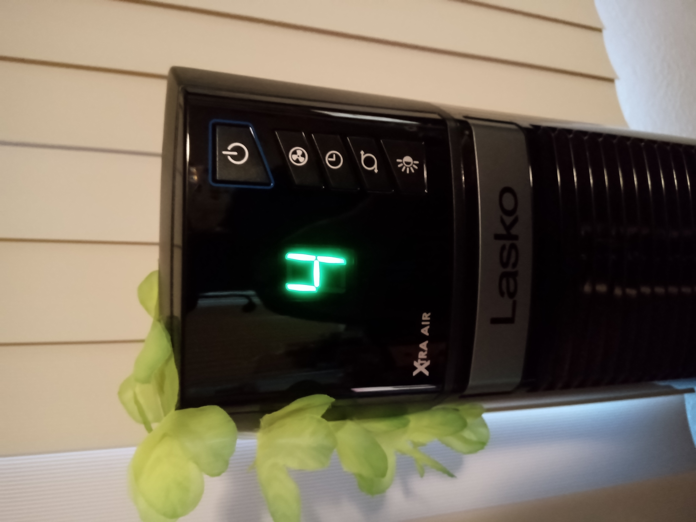
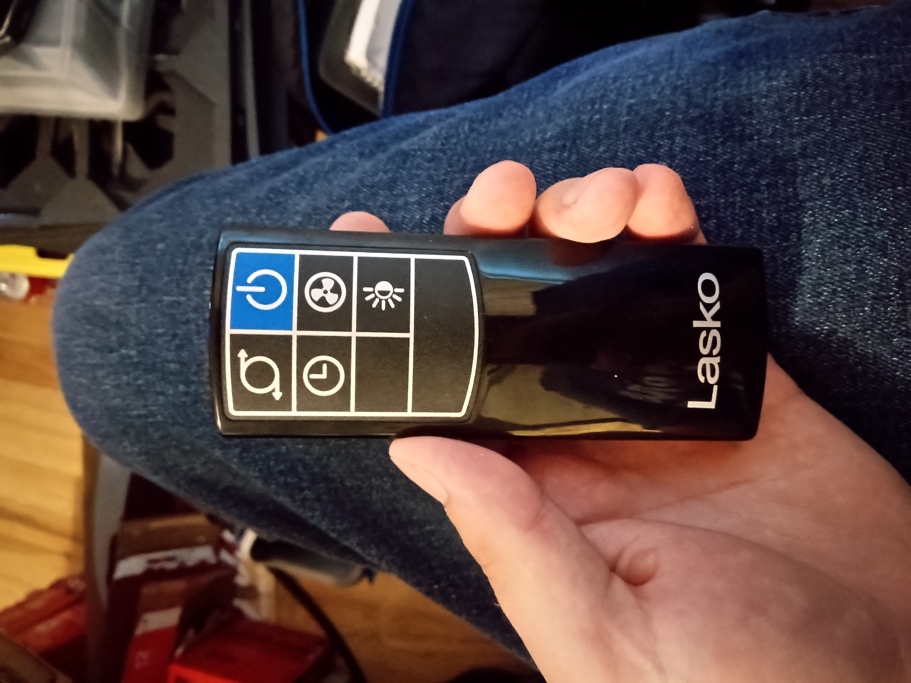
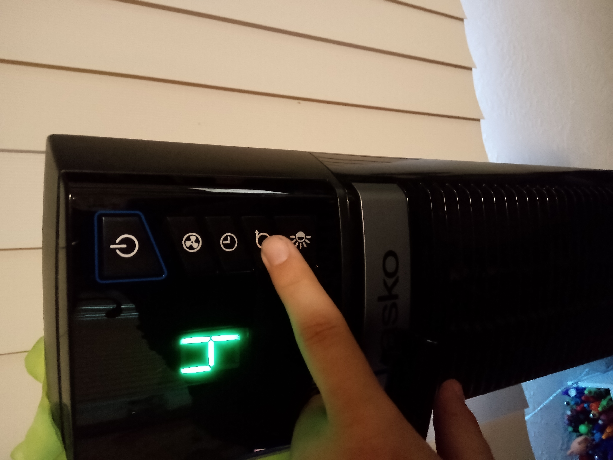
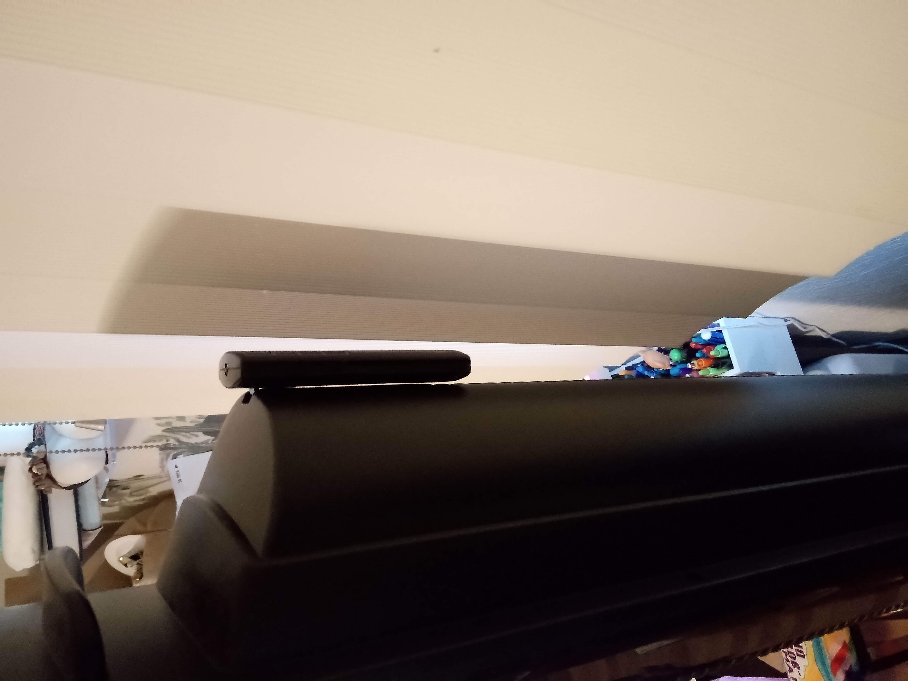

# Weird Buttons and Function on Lasko Fan

Caleb Besser - 9/30/2022

I don't really use new technology all that often, as I do not particularly like changing my habits. But recently I needed a fan to beat the heat we've been having recently in california. This fan sits on a swivel and is a vertical model, it comes with 5 main buttons including a power one, and a remote with the same buttons.

 

My goal for this particular interaction was to figure out if I could set a time for the fan to turn off, so it doesn't waste energy while I am sleeping. I would say the **mental model** I had matched up fairly well with the fan. All of the icons matched what I assumed they would do. However, in my search for how to solve my problem I found some curious things. For one if you look at the remote, and the fan they both have a button for turning on and off the swivel.

These actually do two different things, if only slightly. The one on the remote will turn the swivel on/off, but it will switch which direction it is going each time. Whereas the one on the fan itself, just turns the swivel on/off, the direction is the same. I found this weird as there really isn't anything indicating this. 

After finding this I attempted clicking the button that looked like a clock, assuming this is what I was looking for. Each time you click it, a number goes up, leading me to believe that whatever number I put would be how many minutes till it turned off. However, I set it to 30 and waited an hour. Nothing happened, it just stayed on. I eventually found out it was because when I was done getting to 30, it had just stayed on that screen. When I attempted to click off it just erased my setting. This I do not believe is a good way to **recover from an error**, as I then had to re-click all the way back to 30. Still couldn't figure out how to do it.

I then moved on to another goal, looking for a locking mechanism for the swivel. I wanted to be able to freely move it where I wanted. I was not successful in this venture as I never found this feature, however on the back I did find a hook for the remote. Which previously I had kept on my desk. 

Overall the item shows good **readability**, and **learnability**, which allowed me to, other than the timer, figure out the product very fast.
