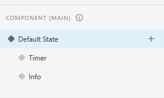

# Adobe XD functionality wanted but not there

Caleb Besser - 12/9/2022

As stated in my previous Journal entry I don't use new things very often. So the only idea I had was to document my time learning Adobe XD for this class. Specifically my attempt at creating a sliding bar for my teams SleepWell prototype. To start I had already tinkered with some test projects, and had found out I could use States on a component to create animations.

 

After using this system to create a toggle switch for the Autoplay feature of the app, I decided I wanted a working brightness bar. This turned out to be difficult however, as first off I didn't know how to make the bar slide, nor how to make the brightness change. So i scrapped the brightness changing idea, and stuck with making the bar move.

After some more tinkering and researching I found that you can animate from one artboard to another, and make a sliding bar effect that way. So I did this, and it actually worked pretty well. I don't have any pictures for this though. But soon I realized that there was a problem, the autoplay button didn't keep its toggle when I switched boards. This is because the other artboard has no way of knowing what state the first one was in.

After a while, and some more research, I came to the conclusion you cannot do it. There is no way to transfer data from artboard to artboard. And there is no way to have one component trigger another one. So as a conclusion, this is functionality that I wish was in Adobe XD. I had to settle for just having a bar there. (But at least my autoplay switch worked).
